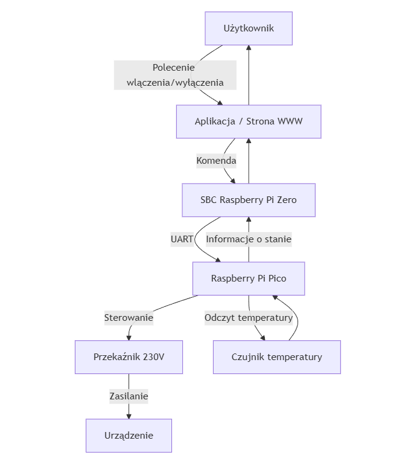
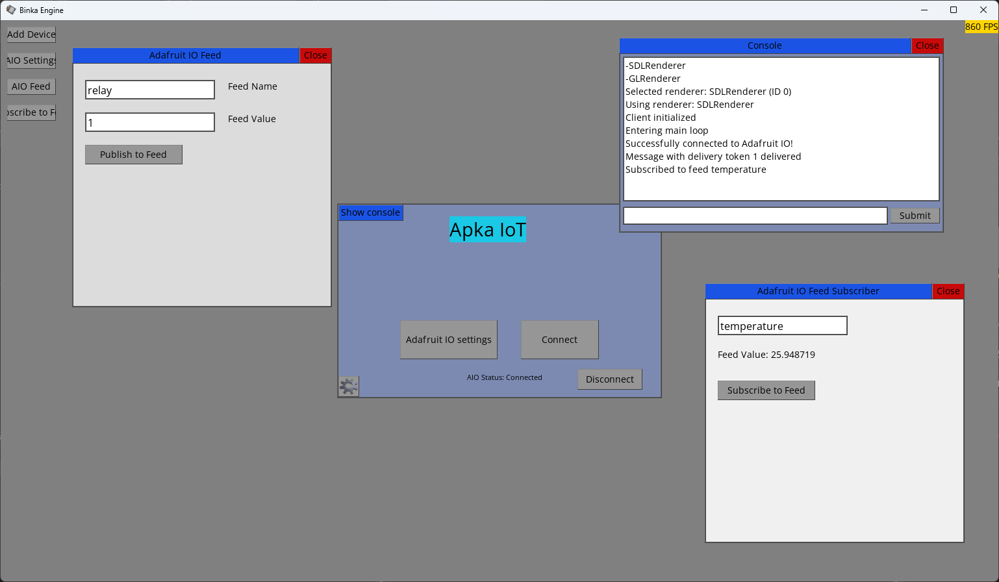

# 🎬 MAKING OF – Historia projektu

Na samym początku musieliśmy wymyślić temat projektu. Musiało to być związane z zagadnieniem IoT.  
Po chwili zastanowienia, ze względu na wcześniejsze doświadczenie z mikrokontrolerami Arduino i sterowaniem zdalnym, postanowiliśmy wybrać jako temat system zdalnego sterowania jakimś urządzeniem.

To były początkowe założenia.

**Nasz projekt:**

“IoT Klimatyzacja, zdalne sterowanie urządzeniami”

Projekt bazuje na zastosowaniu mikrokontrolera Raspberry Pi Pico i SBC (single-board computer) Raspberry Pi Zero.  
Mikrokontroler ma za zadanie odczytywać temperaturę z czujnika temperatury oraz sterować przekaźnikiem 230V, który załącza urządzenie (np. klimatyzację lub wentylator).  
Mikrokontroler połączony jest z SBC za pomocą interfejsu UART, który pozwala na przesyłanie danych między urządzeniami. SBC będzie traktowany jako system zarządzania, zawiera moduł Wi-Fi, co umożliwia połączenie z internetem i zdalne sterowanie.

Przykładowe działanie:  
Użytkownik uruchamia stronę internetową lub aplikację i łączy się z serwerem na SBC → Użytkownik wydaje polecenie włączenia urządzenia → SBC przyjmuje komendę i wysyła sygnał do mikrokontrolera przez UART → Mikrokontroler przyjmuje sygnał sterujący i załącza przekaźnik, przez co urządzenie podłączone do przekaźnika dostaje zasilanie i jest uruchamiane.  

Dodatkowo informacje przekazywane są też w drugą stronę, np. informacje o stanie urządzenia, temperatura, itp.

Jak widać projekt ewoluował w czasie. Zamiast korzystania z pośrednika jakim był Pi Zero, mikrokontrolery zaczęły łączyć się bezpośrednio z Wi-Fi.

---

## Tworzenie projektu

Wymagane było uzyskanie odpowiednich komponentów:  
- Moduł przekaźnika 1 kanał – styki 10A/250VAC – cewka 5V  
- Czujnik temperatury LM35DZ NS – analogowy THT  
- Raspberry Pi Pico 2 WH – RP2350 ARM Cortex M33 + CYW43439 – WiFi/Bluetooth – ze złączami  

To trzeba było dokupić, poza tym mieliśmy już płytki stykowe, przewody, zasilacze itp.

Na samym początku napisaliśmy prosty program, który miał na celu sprawdzenie działania Pico 2 – zwykła dioda LED.  
Następnie podłączyliśmy przekaźnik. Ale nie działał. Okazało się, że pin input na przekaźniku musi być podłączony do 0V, aby załączył się przekaźnik. Na Pico napięcie 3.3V było prawdopodobnie nadal odczytywane jako logiczne LOW. Wymagane było zastosowanie tranzystora. Po podłączeniu do tranzystora przekaźnik zaczął działać poprawnie.

---

## Sterowanie przez sieć

Sterowanie przekaźnikiem przez serial na USB nie było imponujące. Dodaliśmy więc możliwość łączenia się Pico 2 przez Wi-Fi, a następnie wysyłane były do niego komendy przez sieć lokalną.  

Pico rzeczywiście się łączył, można było sprawdzić jego adres IP. Na PC napisaliśmy prostą aplikację, która wysyłała komendę do Pico na konkretny port. Pico otrzymywał tę komendę i mogliśmy sterować stanem pinu, a co za tym idzie – przekaźnikiem.  

Pomimo prostoty aplikacji możliwe było już zdalne sterowanie urządzeniem.  

---

## Interfejs graficzny

Aplikacja konsolowa nie była atrakcyjna. Postanowiliśmy wykorzystać jeden ze starych projektów, który posiadał działający interfejs użytkownika. Miał okienka, przyciski, textboxy – coś w stylu WinForms, ale zrobione od zera z wykorzystaniem SDL2.  
Główną zaletą aplikacji była możliwość kompilacji na wiele platform: Android, Windows, Linux, macOS. Dzięki temu aplikacja na telefonie i komputerze była taka sama.  

Zmieniliśmy menu główne projektu, dodaliśmy więcej przycisków i nowe komendy konsolowe.  
Przypisaliśmy do przycisku ten sam kod, który był w aplikacji konsolowej i mogliśmy włączyć/wyłączyć przekaźnik za pomocą kliknięcia.  

---

## Prototyp listwy

Przekaźnik jest przystosowany do pracy z napięciem do 250V AC, więc można go zamontować np. w listwie.  
Mieliśmy starą niedziałającą listwę antyprzepięciową. Okazało się, że problemem był zepsuty włącznik. Wymieniliśmy go i listwa zaczęła działać.  
Wyciągnęliśmy moduł antyprzepięciowy i w jego miejsce włożyliśmy przekaźnik.  

Prototyp działał – można było sterować listwą przez sieć lokalną.  
Dodaliśmy czujnik temperatury i ustawienie automatycznego załączania listwy po przekroczeniu progu.  

Problemem był jednak długi kabel wychodzący z listwy i ryzyko związane z prowadzeniem przewodu niskiego napięcia obok 230V. Dodatkowo przekaźnik był zawodny – utknął w stanie załączenia.

---

## Smart listwa – finalna wersja

Postanowiliśmy stworzyć nową wersję listwy – w pełni zamkniętą i bezpieczną.  
Dokupiliśmy:  
- XIAO ESP32-C3  
- mały zasilacz 5V  
- przekaźnik z optoizolacją  

Taka kombinacja pozwoliła umieścić wszystko wewnątrz listwy.  
ESP32 wymagało wylutowania części pinów, aby zmieścić się w obudowie.  
Podłączyliśmy kontroler do zasilania i przekaźnika, zamontowaliśmy antenę Wi-Fi.  

Przed zamknięciem listwy wgraliśmy najnowszą wersję programu przez Arduino IDE.  
Dodaliśmy funkcję Access Pointa, aby można było ustawić nowe Wi-Fi.  

Pico otrzymał dodatkowo wyświetlacz OLED, który pokazuje temperaturę i tryb automatycznego załączania.  

---

## Podsumowanie

Pod względem sprzętu projekt jest kompletny.  
Teraz głównym wyzwaniem jest napisanie aplikacji klienckiej oraz aktualizacja kodu mikrokontrolerów.