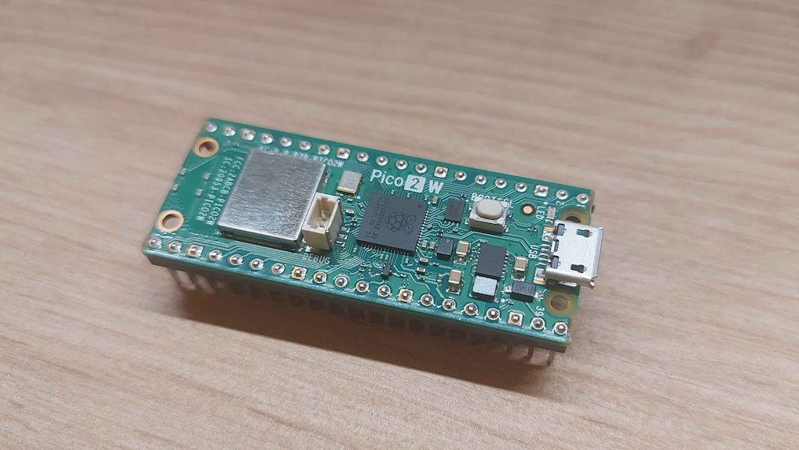
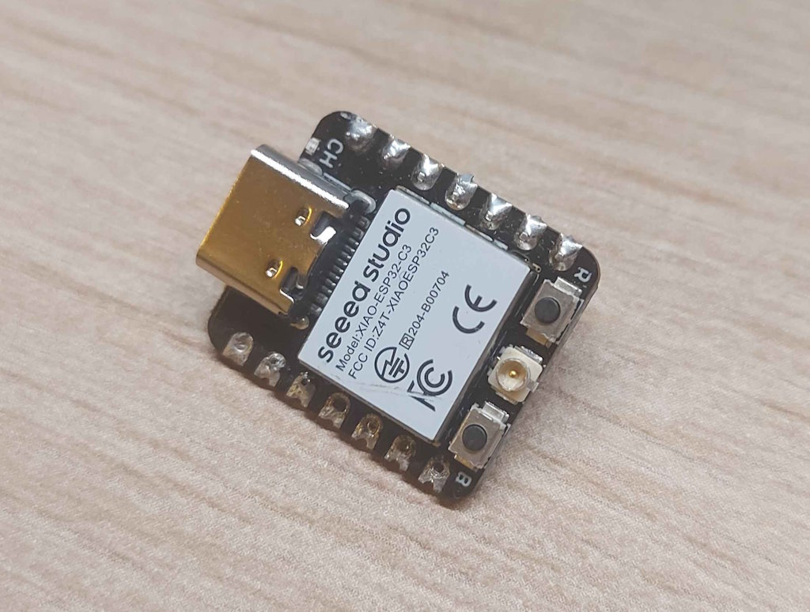

# Projekt IoT: System zdalnego zarządzania urządzeniami domowymi

## Wstęp
Celem projetu jest stworzenie systemu IoT umożliwiającego **zdalne zarządzanie urządzeniami domowymi**.  
System opiera się na aplikacji komputerowej lub mobilnej, która komunikuje się z mikrokontrolerami zarówno w **sieci lokalnej (WiFi)**, jak i przez **internet za pomocą platformy [Adafruit IO](https://io.adafruit.com/)**.

### Wykorzystane mikrokontrolery
- **Raspberry Pi Pico 2 W**

 
  - Czujnik temperatury  
  - Wyświetlacz do prezentacji danych  

- **Seeed Xiao ESP32-C3**  

 
  - Umieszczony w listwie elektrycznej  
  - Sterowanie przekaźnikiem (włączanie/wyłączanie listwy)  

Oba urządzenia:
- Łączą się z domową siecią WiFi  
- Uruchamiają własny **Access Point** przy starcie, co pozwala na konfigurację nowej sieci WiFi oraz danych logowania do Adafruit IO  

---

## Obsługa systemu
1. **Uruchomienie urządzeń**  
   - Po podłączeniu zasilania mikrokontrolery automatycznie łączą się z domową siecią WiFi.  
   - Jeśli sieć nie jest skonfigurowana, urządzenie uruchamia Access Point, umożliwiając ustawienie nowych parametrów.

2. **Aplikacja sterująca**  
   - Dostępna w wersji komputerowej i mobilnej.  
   - Umożliwia:
     - Podgląd temperatury z czujnika Raspberry Pi Pico 2 W  
     - Sterowanie listwą elektryczną poprzez ESP32-C3  
     - Zdalne zarządzanie urządzeniami przez Adafruit IO  

3. **Integracja z Adafruit IO**  
   - Dane z czujników oraz komendy sterujące są przesyłane do chmury.  
   - Dzięki temu możliwe jest sterowanie urządzeniami spoza sieci lokalnej.  

---

## Instrukcja kompilacji i uruchomienia

### Wymagania
- **PlatformIO** lub **Arduino IDE** (dla ESP32-C3)  
- **SDK dla Raspberry Pi Pico** (np. [pico-sdk](https://github.com/raspberrypi/pico-sdk))  
- Konto w [Adafruit IO](https://io.adafruit.com/)  
- Dostęp do sieci WiFi  

### Kroki kompilacji
#### Raspberry Pi Pico 2 W
1. Zainstaluj `pico-sdk` oraz `cmake`.  
2. Sklonuj repozytorium projektu:  
   ```bash
   git clone https://github.com/<twoje-repo>/iot-home-system.git
   cd iot-home-system/pico